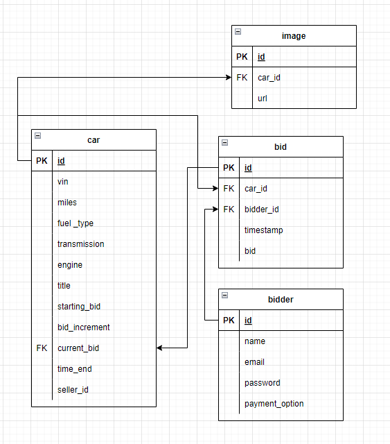

# exotic-car-auctions


## Description:
Are you are looking to buy an exotic Ferrari, an understated Jaguar, or a luxurious Rolls-Royce? Our exotic car auction has many of exotic and luxury vehicles available for auction. Our exotic car inventory is great for finding project cars or new cars at a great price.


## Table of Contents:

- [Description](#description)

- [Acceptance Criteria](#acceptance-criteria)

- [Installation Instructions](#installation-instructions)

- [Screenshot of Application](#screenshot-of-application)

- [Link to Application of Github](#link-to-application-on-github)

- [Link to Deployed Application](#link-to-deployed-application)

- [Database Schema](#database-schema)

- [Questions](#questions)

## User Story
```
As a bidder,
I want to bid on a exotic car
So that I can purchase it
When I signup and login
I am taken to the auction show floor
When I click on a car 
Then I am directed to a bid page 
Given the bid is higher than the current bid, I can enter my bid
When I click on ‘bid history’
I can view a table of previous bids
Given I want to view my bids
When I click on profile tab
Then I can view a list of my bids
```

## Installation Instructions:

- Used the [MySQL2 package](https://www.npmjs.com/package/mysql2) to connect to MySQL database and perform queries
- Used the [Sequelize](https://www.npmjs.com/package/sequelize) packages to connect your Express.js API to a MySQL database
- Used the [dotenv](https://www.npmjs.com/package/dotenv) package to use environment variables to store sensitive data.
- Used Node.js and [Express.js](https://expressjs.com/) to create a RESTful API.
- Used [Handlebars.js](https://handlebarsjs.com/) as the template engine.

## Screenshot of Application:
Here is an image of the Auction Site! 


## Link to Application on Github:
[Github Link](https://github.com/batemanz/exotic-car-auctions)


## Link to Deployed Application:
[Application link](https://exotic-car-auction-abln.herokuapp.com/)


## Database Schema:



## Questions:

For additional questions, reach out to the team:

[Github Link](https://github.com/batemanz/exotic-car-auctions)
